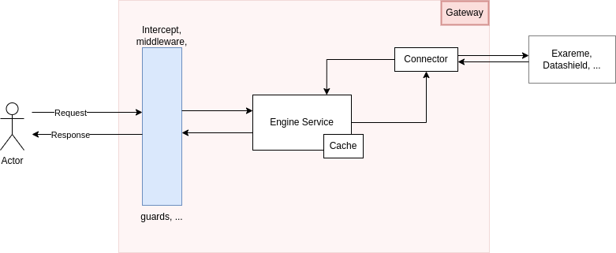

# 📝 Cache

The cache system is a In-Memory cache (but it can be changed to another cache system like Redis, see [nest documentation](https://docs.nestjs.com/techniques/caching)).

In the following picture will see an overview of how a request is handled in the Gateway.&#x20;

The engine service is like a proxy class for the connector, it implements the `Connector` interface as each connector does but it adds some overall functionality to all the connector like the cache.

#### What is cached ?

Currently only `domains` and `algorithms` are cached as they are the most used functions inside the Gateway.

#### Cache life cycle

The cache is create whenever a user makes a query to `domain` or `algorithms` and is user based, so a cache entry is created for every pair of `domains|algorithms-user.id`.&#x20;

When the user logout, all entries linked to the user are cleared.

&#x20;
