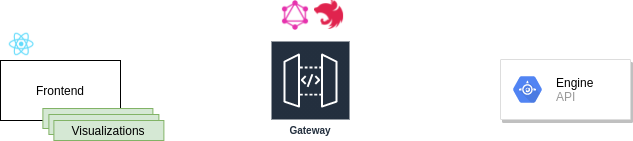
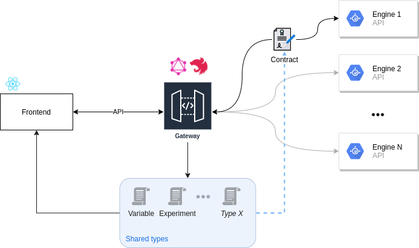
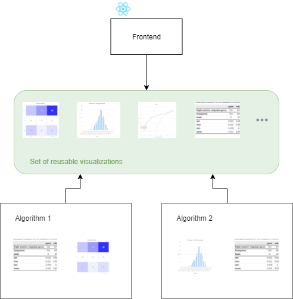

# Introduction

The MIP is mainly composed by 3 components



* **Frontend** : user interface (React.js)
* **Gateway** : middleware used to abstract calls from an engine (Nest.js and GraphQL)
* **Engine** : an API to a concrete engine (Datashield, Exareme, etc...)

## Overview

The Frontend and the Gateway are closely related and their communication are abstracted from the engine. This abstraction is performed by the Gateway.



The Gateway is in charge of communications with various engines, it could make simple calls and pass it to the Frontend or make any transformations needed in order to fit the need in the Frontend.

### GraphQL

GraphQL is used to provide some useful features :

* Shared types/interfaces between Gateway and Frontend
  * With this feature we don't need to redefine every type. Every type/interface are extracted directly from GraphQL endpoint.
* Fully documented endpoint
  * This feature allows to keep track of possibilities offer by the gateway, as this is directly extracted from the code, the description of the types/interfaces and the different calls (query, mutation, subscription) are always up to date.
* Better flexibility in the Frontend
  * We can actually select information needed on every request, that means better separation of concern and isolation of React's components
  * Along with the use of Apollo Client, GraphQL provide a new way to manage State Management

### Connectors

In order to be able to communicate with an engine, the gateway need connectors. A connector is a concrete implementation of the interface `IEngineService`.

```typescript
export default class DatashieldService implements IEngineService {
  constructor(
    private readonly options: IEngineOptions,
    private readonly httpService: HttpService,
  ) {}

  ...
}
```

The code above is an example of a connector.

### Visualizations



With the Frontend we will introduce a new way to deal with visualizations. Previously the visualizations were completely manage by the engine. As a part of abstraction from a specific engine we want to be able to delegate this task to the visualization components.

The main idea is to build various generalist visualization components (BarChart, HeatMap, DataTable, etc...) that every analytic engine can either feed directly or be adapted by the Gateway in order to fit the Frontend needs.
