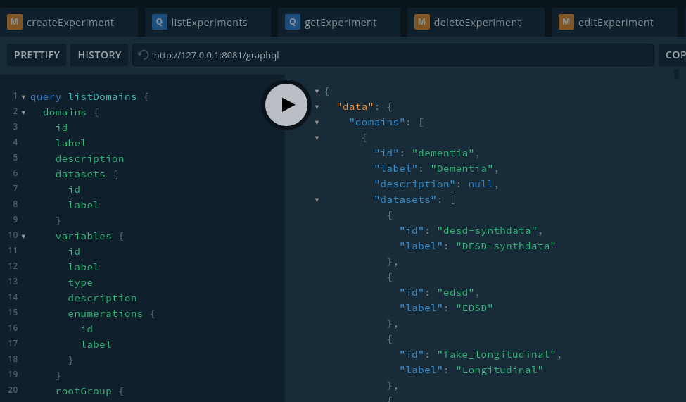

# Setup development environment

This guide is used to setup a full development environment for the MIP Front dev.

## Introduction

As we have seen in the previous chapter we need three component in order to setup the MIP:

* Engine
* Frontend
* Gateway

In this guide we will see how to setup the last two elements.

### Prerequisites

Make sure to have

* [Node.js](https://nodejs.org)
* [NPM](https://npmjs.com)
* [Yarn](https://yarnpkg.com)

installed in your computer.

## Setup Gateway

First of all you should clone the repository 'gateway' either from the [Gitlab](https://gitlab.com/sibmip/gateway) or from the [GitHub](https://github.com/HBPMedical/gateway).

Once the pull is completed, you can make the following commands

```bash
cd gateway/api

git checkout develop

npm install
```

After these steps you should be able to start the gateway in dev mode with the following command

```bash
npm run start:dev
```

### env.defaults

There is an environment file that allows some configuration for the gateway.

```yaml
ENGINE_TYPE=local
ENGINE_BASE_URL=http://127.0.0.1:8080/services/
GATEWAY_PORT=8081
```

* ENGINE\_TYPE
  * Allows you to choose which connector you want to load, `local` is used for development purpose and is not intended to be used in production.
* ENGINE\_BASE\_URL
  * Indicate the endpoint for the engine, this parameter can be retrieve in the connector side. If you are using `local` connector this parameter is not useful.
* GATEWAY\_PORT
  * Indicate the port for the Gateway.

These parameters can be overwrite by either :

* setting a variable in `.env` file (you can create it if it does not exist) along with the file .env.defaults in the root folder
* or setting an environment variable on your system

### GraphQL Playground

Once you have started the Gateway, you can play with the GraphQL playground that is automatically integrated within the gateway, follow this link : [http://127.0.0.1:8081/graphql](http://127.0.0.1:8081/graphql). You should be able to see something like this :



This environment is a tool provided by GraphQL to play with queries, mutations, etc...

It allows you to see schema defined in the backend and endpoints that you can calls.

## Setup Frontend

First of all you should clone the repository 'portal-frontend' either from the [Gitlab](https://gitlab.com/sibmip/portal-frontend) or the [GitHub](https://github.com/HBPMedical/portal-frontend).

Once the pull is completed, you can make the following commands

```bash
cd portal-frontend

git checkout dev

yarn install
```

### Environment file

Make sure that the .env or .env.development contains the following information

```yaml
REACT_APP_BACKEND_URL=http://127.0.0.1:8081
REACT_APP_GATEWAY_URL=$REACT_APP_BACKEND_URL/graphql
```

* REACT\_APP\_BACKEND\_URL
  * Is used to consume REST API call (migration to GraphQL is in progress)
* REACT\_APP\_GATEWAY\_URL
  * Is used to connect with GraphQL Gateway

### Start frontend

Depending the branch you are working on, you can start the Frontend with

```bash
yarn start
```

or

```bash
yarn watch
```

## Launch order

Each service could be launch at any time without respecting any specific order, however as the Frontend (react app) open automatically a browser tab for the local development, it is recommended to follow this launch order

`Engine -> Gateway -> Frontend`

If you are using `local` type in the Gateway you don't need to start the engine.
